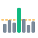
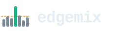

# The logo, and what it means



Seven bars are seven logged seconds. The green one is the peak second. The
dashed line is the **mean**, drawn behind the bars because that is what it is: a
gridline, not a measurement of anything that happened. It sits at less than half
the height of the second that produced the timeouts.

That is the whole argument of the tool, and it is why the mark is a chart rather
than a letter or a network glyph: *the aggregate is not the load*. A reader who
understands the mark has understood [the findings](findings.md) before reading
them.

## The files

Everything lives in [`docs/assets/`](https://github.com/Allan-Nava/edgemix/tree/main/docs/assets)
and is SVG. There is no PNG in this repository — see [below](#raster).

| File | Size | Use |
|---|---|---|
| `edgemix-mark.svg` | `64 × 64` | the mark alone: the site header, an avatar, a slide corner |
| `edgemix-logo-light.svg` | `232 × 64` | the lockup for a light background |
| `edgemix-logo-dark.svg` | `232 × 64` | the same lockup with the wordmark in `#e6edf3` |
| `favicon.svg` | `16 × 16` | the browser tab |

The **mark has no light and no dark variant**, and that is deliberate: its three
colours were picked to read on `#ffffff` and on `#0d1117` alike, so nothing has
to be recoloured, inverted or swapped per theme. Only the lockup comes in two
files, and only because a wordmark is text and text has to have a colour.

## The lockup




Each file is shown here on the background it was drawn for — which is the point
of there being two of them, and of there being only one mark.

## The geometry is generated

The four files are written by
[`scripts/logo.sh`](https://github.com/Allan-Nava/edgemix/blob/main/scripts/logo.sh)
from one geometry, for the same reason `ROADMAP.md` is generated from
`BACKLOG.md`: they share their numbers, and a lockup that drifted two pixels
from the mark is wrong in a way nobody notices.

```
$ scripts/logo.sh geometry
bars      7 seconds: 15 21 17 42 23 13 19
peak      bar 4, 42 req/s (1.96 x the mean)
mean      21.43 req/s
favicon   bars 3..6: 17 42 23 13
```

```bash
scripts/logo.sh write     # regenerate the SVGs from the geometry
scripts/logo.sh check     # fail if the committed files are stale (a CI gate)
scripts/logo.sh geometry  # the numbers the mark is made of
```

The dashed line is **not a drawn decision**: it is the arithmetic mean of the
bar values, computed at generation time. Change a bar and the line moves with
it, so the mark cannot end up claiming an average it does not have. A logo that
lies about its own numbers would be a poor sign for a measurement tool.

The favicon is the mark **restated** at 16px — four of the seven seconds and no
dashed line — rather than the mark shrunk. At that size a 3px dash is a smudge
and seven bars are a grey block.

## Colours

| Role | Hex | Where |
|---|---|---|
| ordinary seconds | `#7c8b9a` | the six slate bars |
| the peak second | `#10b981` | the tall bar, and the accent of the docs site |
| the mean | `#f59e0b` | the dashed line |
| wordmark, light | `#1f2328` | `edgemix-logo-light.svg` |
| wordmark, dark | `#e6edf3` | `edgemix-logo-dark.svg` |

Green for the peak and amber for the mean are the same pairing the terminal
report uses for a measurement and for a caveat, so the mark and the output
agree.

## The wordmark

Set in the **system monospace** — `ui-monospace, SFMono-Regular, "SF Mono",
Menlo, Consolas, "Liberation Mono", monospace` — at 33px, weight 700, tracking
`-1`. It is the face the report itself is read in, and it needs no font file:
a logo that fetched a webfont would be the only network call in a project whose
whole premise is that it makes none.

Because that face differs from machine to machine, the `<text>` element pins its
advance width with `textLength="142" lengthAdjust="spacingAndGlyphs"`. Without
it a wider monospace runs past the `viewBox` and is clipped by the viewport —
which is invisible on the machine that drew the file and obvious on everyone
else's.

## Using it

- **Keep clear space** of at least the width of one bar (6 units, ~9% of the
  mark's width) on every side.
- **Minimum size**: 20px for the mark, 120px wide for the lockup. Below that use
  the favicon geometry, which was drawn for it.
- **Pick the lockup that matches the background**, do not invert one: the mark
  half of the two files is byte-identical, only the wordmark colour differs.
- **Never** recolour the bars, restretch the aspect, add a gradient or set the
  wordmark in another face. The mark is a chart; a stretched chart is a wrong
  chart.
- The name is lowercase — `edgemix`, never `EdgeMix` or `Edgemix` — in prose as
  well as in the logo.

## Raster

No PNG or JPEG is committed. An SVG is text: it reviews in a diff, it is 1.3KB,
and it renders at every size. Producing a raster would need an image toolchain,
and this repository has no dependencies — including in its tooling.

If a platform demands one (a GitHub social preview, a slide deck), generate it
outside the repository with whatever you have installed:

```bash
rsvg-convert -w 1024 docs/assets/edgemix-logo-light.svg -o edgemix.png
# or, on macOS, with no extra install:
qlmanage -t -s 1024 -o . docs/assets/edgemix-logo-light.svg
```

No `.ico` is committed either, for the same reason: it is a binary format that
needs a converter. A browser too old for an SVG favicon — Safari before 16 — shows
its own default icon instead of a wrong one, which is the acceptable failure
here.

## Where it is used

- The [README](https://github.com/Allan-Nava/edgemix#readme), as a `<picture>`
  that swaps the light and dark lockup with the reader's GitHub theme.
- The header of every page of this site, and the tab icon.
- Nothing else. There is no brand system here, and one mark plus one wordmark is
  the whole of it.
